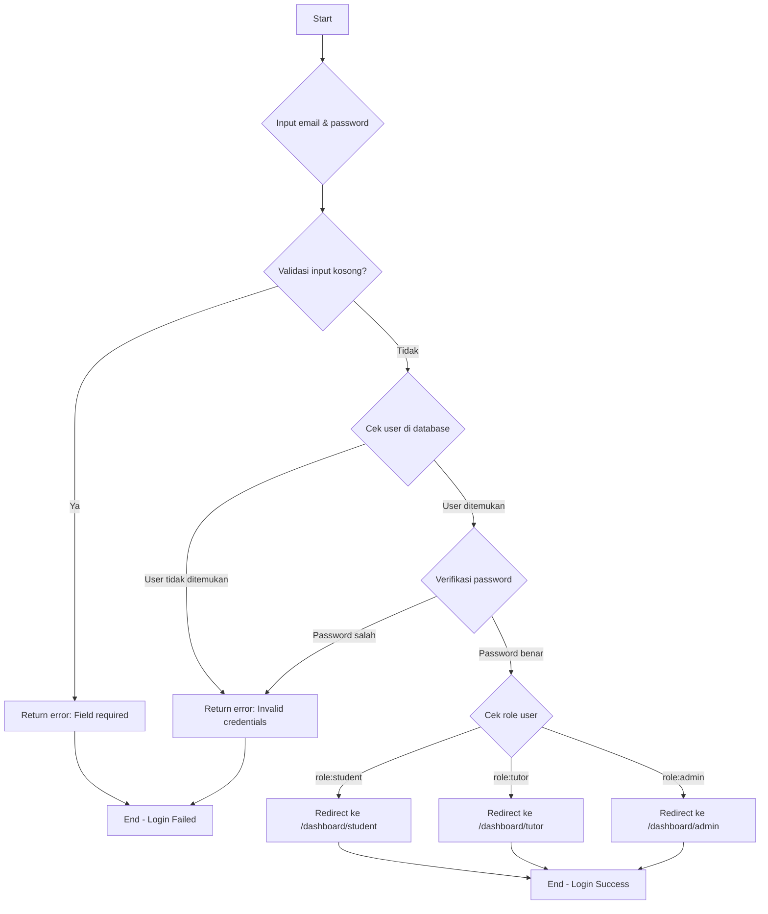
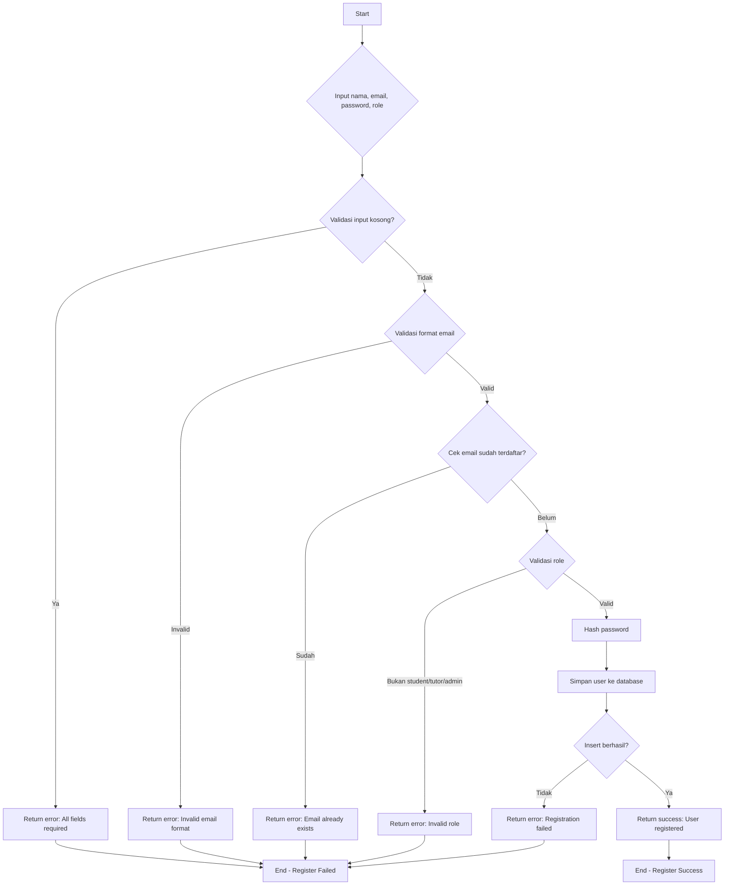
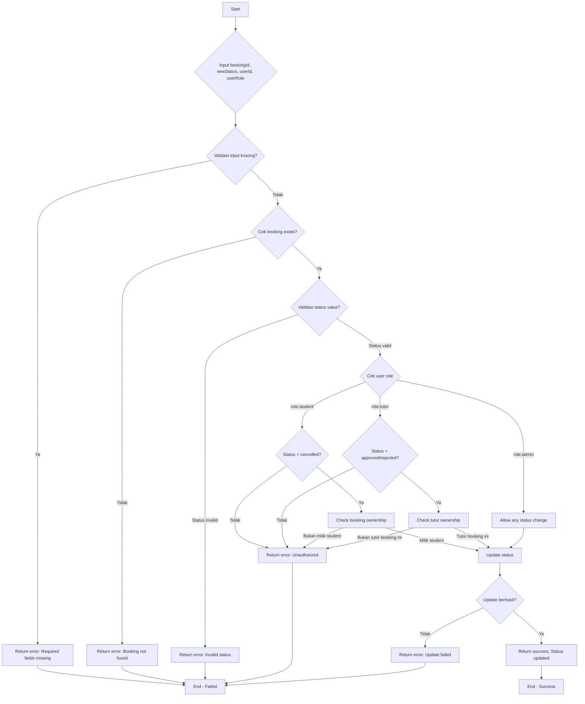
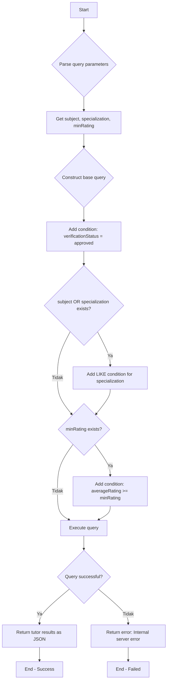
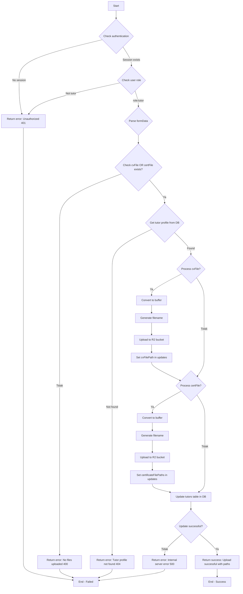
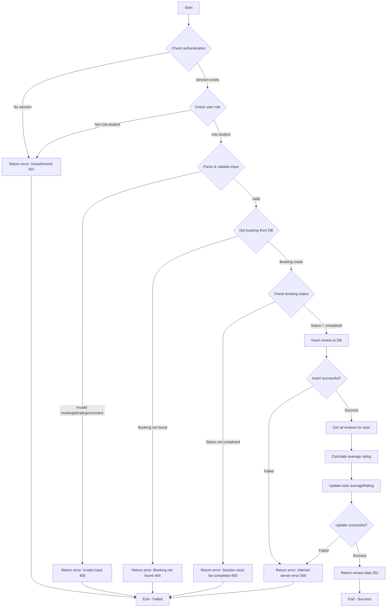
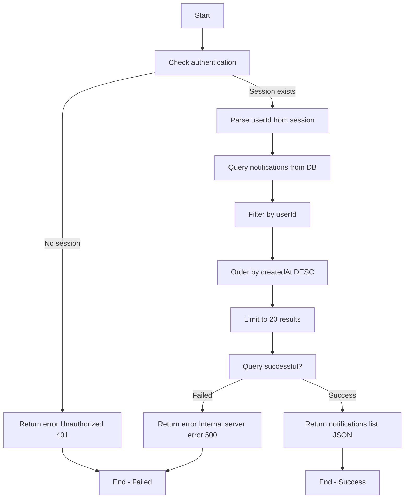
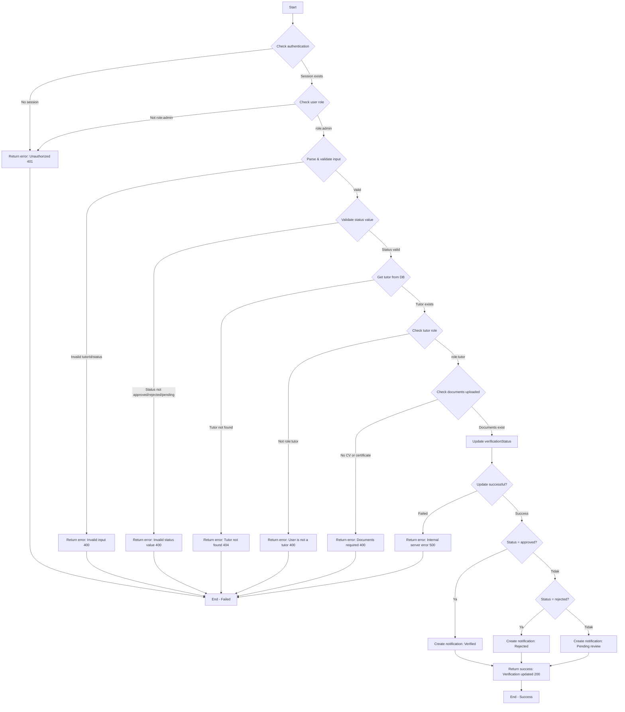

# LAPORAN WHITE BOX TESTING

**Proyek:** Sistem Informasi TutorGo (Platform Pencarian & Pemesanan Tutor)  
**Teknologi:** Next.js 16, TypeScript, PostgreSQL (Drizzle ORM), Tailwind CSS, React 19
**Tim Pengembang:** Kelompok 2  
**Tanggal Pelaporan:** 21 Desember 2025  
**Repository:** [https://github.com/2oog/ppsi-ws25](https://github.com/2oog/ppsi-ws25)  
**Live Demo:** [https://tutorgo.ghi.im/](https://tutorgo.ghi.im/)  
**Versi:** 7

## Bab 1. Pendahuluan

### 1.1 Latar Belakang

White Box Testing dilakukan untuk menguji struktur internal kode backend TutorGo agar seluruh jalur logika (validasi input, autentikasi role-based, error handling, dan business logic) berjalan sesuai desain sistem.
Pengujian ini fokus pada modul-modul API critical seperti Authentication (Login/Register), Bookings (Create/Update), Tutors (Search/Upload Documents), Reviews, Notifications, dan Tutor Verification Admin yang telah diuji menggunakan Vitest pada Bab 4.

### 1.2 Tujuan

Tujuan pengujian white box pada TutorGo adalah:

- Memverifikasi setiap jalur independen pada flow graph menghasilkan output sesuai expected result.
- Mengidentifikasi bug logika pada kondisi kompleks seperti role-based authorization, validasi dokumen, dan status workflow booking.
- Mengukur kompleksitas kode menggunakan Cyclomatic Complexity (\(VG = E - N + 2\)) untuk menentukan test coverage minimum.

### 1.3 Ruang Lingkup

Pengujian white box mencakup 9 modul API backend TutorGo yang diuji pada Bab 4 dengan pendekatan flow graph → Cyclomatic Complexity → Independent Paths → Test Results.
Fokus pada unit testing dengan Vitest (\*.test.ts) untuk memvalidasi business logic, error handling, dan database interactions pada versi 7 aplikasi.
Lingkup terbatas pada kode TypeScript server-side, tidak mencakup frontend React atau styling Tailwind CSS.

## Bab 2. Landasan Teori

### 2.1 Pengertian White Box Testing

White Box Testing adalah teknik pengujian perangkat lunak yang menguji struktur internal kode (control flow, data flow, branches, loops) dengan pengetahuan penuh tentang implementasi program.
Pada TutorGo, white box testing digunakan untuk memastikan logic kompleks seperti role-based access (student/tutor/admin) dan workflow multi-step (booking → verification → review) bekerja sempurna.

### 2.2 Teknik White Box Testing

Teknik utama yang digunakan:

- **Statement Coverage**: Setiap statement dieksekusi minimal sekali
- **Branch Coverage**: Setiap decision outcome (true/false) diuji
- **Path Coverage**: Semua jalur independen melalui flow graph
- **Cyclomatic Complexity**: Mengukur jumlah jalur independen minimum

### 2.3 Cyclomatic Complexity

Rumus: \(VG = E - N + 2P\) dimana \(E\) = jumlah edge, \(N\) = jumlah node, \(P\) = jumlah connected components (biasanya \(P=1\)).
Contoh dari Bab 4 Modul Login: \(E=16, N=12 \rightarrow VG=6\) jalur independen.
Nilai VG menentukan jumlah minimum test case yang diperlukan untuk mencapai path coverage 100%.

## Bab 3. Objek Pengujian

Objek pengujian adalah 9 modul API backend TutorGo v7 yang telah diuji white box pada Bab 4 menggunakan Vitest.

| No  | Modul                     | File Kode                                   | File Test                                        | Cyclomatic Complexity | Deskripsi                                                                          |
| --- | ------------------------- | ------------------------------------------- | ------------------------------------------------ | --------------------- | ---------------------------------------------------------------------------------- |
| 1   | Authentication - Login    | `lib/auth.ts`                               | `lib/auth.test.ts`                               | VG=6                  | Validasi input → cek user → verify password → role-based redirect                  |
| 2   | Authentication - Register | `app/api/auth/register/route.ts`            | `app/api/auth/register/route.test.ts`            | VG=6                  | Validasi fields → email format → duplicate check → role validation → hash & insert |
| 3   | Bookings - Create         | `app/api/bookings/route.ts`                 | `app/api/bookings/route.test.ts`                 | VG=7                  | Validasi → cek student/tutor → availability → time validation → create pending     |
| 4   | Bookings - Update Status  | `app/api/bookings/[id]/route.ts`            | `app/api/bookings/[id]/route.test.ts`            | VG=11                 | Role authorization → ownership check → status validation → update                  |
| 5   | Tutors - Search           | `app/api/tutors/route.ts`                   | `app/api/tutors/route.test.ts`                   | VG=4                  | Query filtering (subject/specialization/minRating) → approved tutors only          |
| 6   | Tutors - Upload Documents | `app/api/tutors/documents/route.ts`         | `app/api/tutors/documents/route.test.ts`         | VG=8                  | Tutor auth → form parsing → file upload R2 → DB update                             |
| 7   | Reviews - Create          | `app/api/reviews/route.ts`                  | `app/api/reviews/route.test.ts`                  | VG=8                  | Student auth → booking completed check → insert review → update tutor rating       |
| 8   | Notifications - Get       | `app/api/notifications/route.ts`            | `app/api/notifications/route.test.ts`            | VG=3                  | Session auth → user-specific query → sort & limit 20                               |
| 9   | Tutor Verification Admin  | `app/api/admin/tutors/[id]/verify/route.ts` | `app/api/admin/tutors/[id]/verify/route.test.ts` | VG=11                 | Admin auth → tutor/docs validation → status update → notification                  |

## 4.1 Modul Authentication - Login

### 4.1.1 Kode Program yang Diuji

- Kode yang diuji: [`lib/auth.ts`](https://github.com/2oog/ppsi-ws25/blob/main/lib/auth.ts).
- Kode pengujian Vitest: [`lib/auth.test.ts`](https://github.com/2oog/ppsi-ws25/blob/main/lib/auth.test.ts).

### 4.1.2 Flowchart / Flow Graph



### 4.1.3 Perhitungan Cyclomatic Complexity

**Rumus:**
\[ V(G) = E - N + 2 \]

Berdasarkan flow graph di atas:

- Jumlah Edge (E) = 16
- Jumlah Node (N) = 12 (Node L dan M disatukan)

Maka:
\[ V(G) = 16 - 12 + 2 = 6 \]

Artinya terdapat **6 jalur independen** yang harus diuji.

### 4.1.4 Jalur Independen (Independent Path)

| **Jalur** | **Alur Eksekusi**                                                                               |
| --------- | ----------------------------------------------------------------------------------------------- |
| Path 1    | Start → Input kosong → Error: Field required → End                                              |
| Path 2    | Start → Input valid → User tidak ditemukan → Error: Invalid credentials → End                   |
| Path 3    | Start → Input valid → User ditemukan → Password salah → Error: Invalid credentials → End        |
| Path 4    | Start → Input valid → User ditemukan → Password benar → Role: student → Dashboard student → End |
| Path 5    | Start → Input valid → User ditemukan → Password benar → Role: tutor → Dashboard tutor → End     |
| Path 6    | Start → Input valid → User ditemukan → Password benar → Role: admin → Dashboard admin → End     |

### 4.1.5 Tabel Hasil Pengujian

| **Path** | **Input**                                          | **Output Diharapkan**          | **Hasil Aktual**               | **Status** |
| -------- | -------------------------------------------------- | ------------------------------ | ------------------------------ | ---------- |
| Path 1   | email: "", password: ""                            | Error: Field required          | Error: Field required          | ✅ Valid   |
| Path 2   | email: "unknown@test.com", password: "12345"       | Error: Invalid credentials     | Error: Invalid credentials     | ✅ Valid   |
| Path 3   | email: "student@test.com", password: "wrongpass"   | Error: Invalid credentials     | Error: Invalid credentials     | ✅ Valid   |
| Path 4   | email: "student@test.com", password: "correctpass" | Redirect ke /dashboard/student | Redirect ke /dashboard/student | ✅ Valid   |
| Path 5   | email: "tutor@test.com", password: "correctpass"   | Redirect ke /dashboard/tutor   | Redirect ke /dashboard/tutor   | ✅ Valid   |
| Path 6   | email: "admin@test.com", password: "correctpass"   | Redirect ke /dashboard/admin   | Redirect ke /dashboard/admin   | ✅ Valid   |

---

## 4.2 Modul Authentication - Register

### 4.2.1 Kode Program yang Diuji

- Kode yang diuji: [`app/api/auth/register/route.ts`](https://github.com/2oog/ppsi-ws25/blob/main/app/api/auth/register/route.ts)
- Kode pengujian Vitest: [`app/api/auth/register/route.test.ts`](https://github.com/2oog/ppsi-ws25/blob/main/app/api/auth/register/route.test.ts)

### 4.2.2 Flowchart / Flow Graph



### 4.2.3 Perhitungan Cyclomatic Complexity

**Rumus:**
\[ V(G) = E - N + 2 \]

Berdasarkan flow graph di atas:

- Jumlah Edge (E) = 20
- Jumlah Node (N) = 16 (Node P dan Q disatukan)

Maka:
\[ V(G) = 20 - 16 + 2 = 6 \]

Artinya terdapat **6 jalur independen** yang harus diuji.

### 4.2.4 Jalur Independen (Independent Path)

| **Jalur** | **Alur Eksekusi**                                                                                                                                      |
| --------- | ------------------------------------------------------------------------------------------------------------------------------------------------------ |
| Path 1    | Start → Input kosong → Error: All fields required → End                                                                                                |
| Path 2    | Start → Input lengkap → Format email invalid → Error: Invalid email format → End                                                                       |
| Path 3    | Start → Input lengkap → Email valid → Email sudah terdaftar → Error: Email already exists → End                                                        |
| Path 4    | Start → Input lengkap → Email valid → Email baru → Role invalid → Error: Invalid role → End                                                            |
| Path 5    | Start → Input lengkap → Email valid → Email baru → Role valid → Hash password → Insert gagal → Error: Registration failed → End                        |
| Path 6    | Start → Input lengkap → Email valid → Email baru → Role valid (student/tutor/admin) → Hash password → Insert berhasil → Success: User registered → End |

### 4.2.5 Tabel Hasil Pengujian

| **Path** | **Input**                                                                               | **Output Diharapkan**                 | **Hasil Aktual**            | **Status** |
| -------- | --------------------------------------------------------------------------------------- | ------------------------------------- | --------------------------- | ---------- |
| Path 1   | nama: "", email: "", password: "", role: ""                                             | Error: All fields required            | Error: All fields required  | ✅ Valid   |
| Path 2   | nama: "John", email: "invalid-email", password: "123", role: "student"                  | Error: Invalid email format           | Error: Invalid email format | ✅ Valid   |
| Path 3   | nama: "John", email: "existing@test.com", password: "123", role: "student"              | Error: Email already exists           | Error: Email already exists | ✅ Valid   |
| Path 4   | nama: "John", email: "new@test.com", password: "123", role: "superuser"                 | Error: Invalid role                   | Error: Invalid role         | ✅ Valid   |
| Path 5   | nama: "John", email: "new@test.com", password: "123", role: "student"                   | Error: Registration failed (DB error) | Error: Registration failed  | ✅ Valid   |
| Path 6   | nama: "John Doe", email: "newstudent@test.com", password: "securepass", role: "student" | Success: User registered              | Success: User registered    | ✅ Valid   |
| Path 7   | nama: "Jane Tutor", email: "newtutor@test.com", password: "securepass", role: "tutor"   | Success: User registered              | Success: User registered    | ✅ Valid   |
| Path 8   | nama: "Admin User", email: "newadmin@test.com", password: "securepass", role: "admin"   | Success: User registered              | Success: User registered    | ✅ Valid   |

## 4.3 Modul Bookings - Create Booking

### 4.3.1 Kode Program yang Diuji

- Kode yang diuji: `POST` di [`app/api/bookings/route.ts`](https://github.com/2oog/ppsi-ws25/blob/main/app/api/bookings/route.ts)
- Kode pengujian Vitest: [`app/api/bookings/route.test.ts`](https://github.com/2oog/ppsi-ws25/blob/main/app/api/bookings/route.test.ts)

### 4.3.2 Flowchart / Flow Graph

```mermaid
graph TD
graph TD
    A[Start] --> B{Input studentId, tutorId, subject, date, time}
    B --> C{Validasi input kosong?}
    C -->|Ya| D[Return error: All fields required]
    C -->|Tidak| E{Cek student exists?}
    E -->|Tidak| F[Return error: Student not found]
    E -->|Ya| G{Cek tutor exists?}
    G -->|Tidak| H[Return error: Tutor not found]
    G -->|Ya| I{Cek tutor availability?}
    I -->|Tutor tidak available| J[Return error: Tutor not available]
    I -->|Tutor available| K{Validasi waktu booking?}
    K -->|Waktu sudah lewat| L[Return error: Invalid booking time]
    K -->|Waktu valid| M[Create booking dengan status: pending]
    M --> N{Insert berhasil?}
    N -->|Tidak| O[Return error: Booking creation failed]
    N -->|Ya| P[Return success: Booking created]
    P --> Q[End - Success]
    D --> R[End - Failed]
    F --> R
    H --> R
    J --> R
    L --> R
    O --> R
```

### 4.3.3 Perhitungan Cyclomatic Complexity

**Rumus:**
\[ V(G) = E - N + 2 \]

Berdasarkan flow graph di atas:

- Jumlah Edge (E) = 22
- Jumlah Node (N) = 17 (Node Q dan R disatukan)

Maka:
\[ V(G) = 22 - 17 + 2 = 7 \]

Artinya terdapat **7 jalur independen** yang harus diuji.

### 4.3.4 Jalur Independen (Independent Path)

| **Jalur** | **Alur Eksekusi**                                                                                                                                    |
| --------- | ---------------------------------------------------------------------------------------------------------------------------------------------------- |
| Path 1    | Start → Input kosong → Error: All fields required → End                                                                                              |
| Path 2    | Start → Input lengkap → Student tidak ditemukan → Error: Student not found → End                                                                     |
| Path 3    | Start → Input lengkap → Student ada → Tutor tidak ditemukan → Error: Tutor not found → End                                                           |
| Path 4    | Start → Input lengkap → Student ada → Tutor ada → Tutor tidak available → Error: Tutor not available → End                                           |
| Path 5    | Start → Input lengkap → Student ada → Tutor ada → Tutor available → Waktu invalid → Error: Invalid booking time → End                                |
| Path 6    | Start → Input lengkap → Student ada → Tutor ada → Tutor available → Waktu valid → Insert gagal → Error: Booking creation failed → End                |
| Path 7    | Start → Input lengkap → Student ada → Tutor ada → Tutor available → Waktu valid → Insert berhasil → Success: Booking created (status: pending) → End |

### 4.3.5 Tabel Hasil Pengujian

| **Path** | **Input**                                                                      | **Output Diharapkan**                      | **Hasil Aktual**                           | **Status** |
| -------- | ------------------------------------------------------------------------------ | ------------------------------------------ | ------------------------------------------ | ---------- |
| Path 1   | studentId: null, tutorId: null, subject: "", date: null                        | Error: All fields required                 | Error: All fields required                 | ✅ Valid   |
| Path 2   | studentId: 999, tutorId: 1, subject: "Math", date: "2025-12-25", time: "10:00" | Error: Student not found                   | Error: Student not found                   | ✅ Valid   |
| Path 3   | studentId: 1, tutorId: 999, subject: "Math", date: "2025-12-25", time: "10:00" | Error: Tutor not found                     | Error: Tutor not found                     | ✅ Valid   |
| Path 4   | studentId: 1, tutorId: 2, subject: "Math", date: "2025-12-25", time: "10:00"   | Error: Tutor not available                 | Error: Tutor not available                 | ✅ Valid   |
| Path 5   | studentId: 1, tutorId: 2, subject: "Math", date: "2025-12-01", time: "10:00"   | Error: Invalid booking time                | Error: Invalid booking time                | ✅ Valid   |
| Path 6   | studentId: 1, tutorId: 2, subject: "Math", date: "2025-12-25", time: "10:00"   | Error: Booking creation failed (DB error)  | Error: Booking creation failed             | ✅ Valid   |
| Path 7   | studentId: 1, tutorId: 2, subject: "Math", date: "2025-12-25", time: "10:00"   | Success: Booking created (status: pending) | Success: Booking created (status: pending) | ✅ Valid   |

## 4.4 Modul Bookings - Update Status

### 4.4.1 Kode Program yang Diuji

- Kode yang diuji: `PUT` di [`app/api/bookings/[id]/route.ts`](https://github.com/2oog/ppsi-ws25/blob/main/app/api/bookings/[id]/route.ts)
- Kode pengujian Vitest: [`app/api/bookings/[id]/route.test.ts`](https://github.com/2oog/ppsi-ws25/blob/main/app/api/bookings/[id]/route.test.ts)

### 4.4.2 Flowchart / Flow Graph



### 4.4.3 Perhitungan Cyclomatic Complexity

**Rumus:**
\[ V(G) = E - N + 2 \]

Berdasarkan flow graph di atas:

- Jumlah Edge (E) = 29
- Jumlah Node (N) = 20 (Node T dan U disatukan)

Maka:
\[ V(G) = 29 - 20 + 2 = 11 \]

Artinya terdapat **11 jalur independen** yang harus diuji.

### 4.4.4 Jalur Independen (Independent Path)

| **Jalur** | **Alur Eksekusi**                                                                                                                         |
| --------- | ----------------------------------------------------------------------------------------------------------------------------------------- |
| Path 1    | Start → Input kosong → Error: Required fields missing → End                                                                               |
| Path 2    | Start → Input lengkap → Booking tidak ditemukan → Error: Booking not found → End                                                          |
| Path 3    | Start → Input lengkap → Booking ada → Status invalid → Error: Invalid status → End                                                        |
| Path 4    | Start → Input lengkap → Booking ada → Status valid → Role: student → Status bukan cancelled → Error: Unauthorized → End                   |
| Path 5    | Start → Input lengkap → Booking ada → Status valid → Role: student → Status = cancelled → Bukan milik student → Error: Unauthorized → End |
| Path 6    | Start → Input lengkap → Booking ada → Status valid → Role: student → Status = cancelled → Milik student → Update berhasil → Success → End |
| Path 7    | Start → Input lengkap → Booking ada → Status valid → Role: tutor → Status bukan approved/rejected → Error: Unauthorized → End             |
| Path 8    | Start → Input lengkap → Booking ada → Status valid → Role: tutor → Status = approved → Bukan tutor booking → Error: Unauthorized → End    |
| Path 9    | Start → Input lengkap → Booking ada → Status valid → Role: tutor → Status = approved → Tutor booking → Update berhasil → Success → End    |
| Path 10   | Start → Input lengkap → Booking ada → Status valid → Role: admin → Update berhasil → Success → End                                        |

### 4.4.5 Tabel Hasil Pengujian

| **Path** | **Input**                                                             | **Output Diharapkan**                     | **Hasil Aktual**                     | **Status** |
| -------- | --------------------------------------------------------------------- | ----------------------------------------- | ------------------------------------ | ---------- |
| Path 1   | bookingId: null, newStatus: null                                      | Error: Required fields missing            | Error: Required fields missing       | ✅ Valid   |
| Path 2   | bookingId: 999, newStatus: "approved", userId: 1, role: "tutor"       | Error: Booking not found                  | Error: Booking not found             | ✅ Valid   |
| Path 3   | bookingId: 1, newStatus: "invalid_status", userId: 1, role: "student" | Error: Invalid status                     | Error: Invalid status                | ✅ Valid   |
| Path 4   | bookingId: 1, newStatus: "approved", userId: 1, role: "student"       | Error: Unauthorized                       | Error: Unauthorized                  | ✅ Valid   |
| Path 5   | bookingId: 1, newStatus: "cancelled", userId: 2, role: "student"      | Error: Unauthorized (bukan pemilik)       | Error: Unauthorized                  | ✅ Valid   |
| Path 6   | bookingId: 1, newStatus: "cancelled", userId: 1, role: "student"      | Success: Status updated to cancelled      | Success: Status updated to cancelled | ✅ Valid   |
| Path 7   | bookingId: 1, newStatus: "cancelled", userId: 2, role: "tutor"        | Error: Unauthorized                       | Error: Unauthorized                  | ✅ Valid   |
| Path 8   | bookingId: 1, newStatus: "approved", userId: 3, role: "tutor"         | Error: Unauthorized (bukan tutor booking) | Error: Unauthorized                  | ✅ Valid   |
| Path 9   | bookingId: 1, newStatus: "approved", userId: 2, role: "tutor"         | Success: Status updated to approved       | Success: Status updated to approved  | ✅ Valid   |
| Path 10  | bookingId: 1, newStatus: "completed", userId: 5, role: "admin"        | Success: Status updated to completed      | Success: Status updated to completed | ✅ Valid   |

## 4.5 Modul Tutors - Search Tutors

### 4.5.1 Kode Program yang Diuji

- Kode yang diuji: `GET` di [`app/api/tutors/route.ts`](https://github.com/2oog/ppsi-ws25/blob/main/app/api/tutors/route.ts)
- Kode pengujian Vitest: [`app/api/tutors/route.test.ts`](https://github.com/2oog/ppsi-ws25/blob/main/app/api/tutors/route.test.ts)

### 4.5.2 Flowchart / Flow Graph



### 4.5.3 Perhitungan Cyclomatic Complexity

**Rumus:**
\[ V(G) = E - N + 2 \]

Berdasarkan flow graph di atas:

- Jumlah Edge (E) = 16
- Jumlah Node (N) = 14 (Node N dan O disatukan)

Maka:
\[ V(G) = 16 - 14 + 2 = 4 \]

Artinya terdapat **4 jalur independen** yang harus diuji.

### 4.5.4 Jalur Independen (Independent Path)

| **Jalur** | **Alur Eksekusi**                                                                                                           |
| --------- | --------------------------------------------------------------------------------------------------------------------------- |
| Path 1    | Start → Parse params → Base query → No filters → Execute query → Query success → Return results → End                       |
| Path 2    | Start → Parse params → Base query → subject/specialization filter → Execute query → Query success → Return results → End    |
| Path 3    | Start → Parse params → Base query → subject/specialization filter → minRating filter → Execute query → Return results → End |
| Path 4    | Start → Parse params → Base query → minRating filter only → Execute query → Query success → Return results → End            |
| Path 5    | Start → Parse params → Base query → Any filters → Execute query → Query failed → Return error: Internal server error → End  |

### 4.5.5 Tabel Hasil Pengujian

| **Path** | **Input**                          | **Output Diharapkan**                       | **Hasil Aktual**                            | **Status** |
| -------- | ---------------------------------- | ------------------------------------------- | ------------------------------------------- | ---------- |
| Path 1   | No query params                    | List of all approved tutors                 | List of all approved tutors                 | ✅ Valid   |
| Path 2   | subject: "Math"                    | List of tutors with Math in specialization  | List of tutors with Math in specialization  | ✅ Valid   |
| Path 3   | subject: "Physics", minRating: "4" | List of tutors with Physics and rating >= 4 | List of tutors with Physics and rating >= 4 | ✅ Valid   |
| Path 4   | minRating: "4.5"                   | List of tutors with rating >= 4.5           | List of tutors with rating >= 4.5           | ✅ Valid   |
| Path 5   | (simulate DB error)                | Error: Internal server error (status 500)   | Error: Internal server error (status 500)   | ✅ Valid   |

---

## 4.6 Modul Tutors - Upload Documents

### 4.6.1 Kode Program yang Diuji

- Kode yang diuji: `POST` di [`app/api/tutors/documents/route.ts`](https://github.com/2oog/ppsi-ws25/blob/main/app/api/tutors/documents/route.ts)
- Kode pengujian Vitest: [`app/api/tutors/documents/route.test.ts`](https://github.com/2oog/ppsi-ws25/blob/main/app/api/tutors/documents/route.test.ts)

### 4.6.2 Flowchart / Flow Graph



### 4.6.3 Perhitungan Cyclomatic Complexity

**Rumus:**
\[ V(G) = E - N + 2 \]

Berdasarkan flow graph di atas:

- Jumlah Edge (E) = 30
- Jumlah Node (N) = 24 (Node X dan Y disatukan)

Maka:
\[ V(G) = 30 - 24 + 2 = 8 \]

Artinya terdapat **8 jalur independen** yang harus diuji.

### 4.6.4 Jalur Independen (Independent Path)

| **Jalur** | **Alur Eksekusi**                                                                                                                      |
| --------- | -------------------------------------------------------------------------------------------------------------------------------------- |
| Path 1    | Start → No session → Error: Unauthorized → End                                                                                         |
| Path 2    | Start → Session exists → Role bukan tutor → Error: Unauthorized → End                                                                  |
| Path 3    | Start → Session exists → Role tutor → Parse formData → No files uploaded → Error: No files uploaded → End                              |
| Path 4    | Start → Session exists → Role tutor → Files uploaded → Tutor profile not found → Error: Tutor profile not found → End                  |
| Path 5    | Start → Session exists → Role tutor → cvFile only → Tutor found → Upload CV → Update DB success → Success: Upload successful → End     |
| Path 6    | Start → Session exists → Role tutor → certFile only → Tutor found → Upload cert → Update DB success → Success: Upload successful → End |
| Path 7    | Start → Session exists → Role tutor → Both files → Tutor found → Upload both → Update DB success → Success: Upload successful → End    |
| Path 8    | Start → Session exists → Role tutor → Files uploaded → Tutor found → Upload error/DB error → Error: Internal server error → End        |

### 4.6.5 Tabel Hasil Pengujian

| **Path** | **Input**                                                 | **Output Diharapkan**                        | **Hasil Aktual**                             | **Status** |
| -------- | --------------------------------------------------------- | -------------------------------------------- | -------------------------------------------- | ---------- |
| Path 1   | No session                                                | Error: Unauthorized (status 401)             | Error: Unauthorized (status 401)             | ✅ Valid   |
| Path 2   | session: role:student, files: cv.pdf                      | Error: Unauthorized (status 401)             | Error: Unauthorized (status 401)             | ✅ Valid   |
| Path 3   | session: role:tutor, files: none                          | Error: No files uploaded (status 400)        | Error: No files uploaded (status 400)        | ✅ Valid   |
| Path 4   | session: role:tutor (no tutor profile), files: cv.pdf     | Error: Tutor profile not found (status 404)  | Error: Tutor profile not found (status 404)  | ✅ Valid   |
| Path 5   | session: role:tutor, files: cv.pdf only                   | Success: Upload successful (cvFilePath)      | Success: Upload successful (cvFilePath)      | ✅ Valid   |
| Path 6   | session: role:tutor, files: certificate.pdf only          | Success: Upload successful (certificatePath) | Success: Upload successful (certificatePath) | ✅ Valid   |
| Path 7   | session: role:tutor, files: cv.pdf + certificate.pdf      | Success: Upload successful (both paths)      | Success: Upload successful (both paths)      | ✅ Valid   |
| Path 8   | session: role:tutor, files: cv.pdf (simulate R2/DB error) | Error: Internal server error (status 500)    | Error: Internal server error (status 500)    | ✅ Valid   |

## 4.7 Modul Reviews - Create Review

### 4.7.1 Kode Program yang Diuji

- Kode yang diuji: `POST` di [`app/api/reviews/route.ts`](https://github.com/2oog/ppsi-ws25/blob/main/app/api/reviews/route.ts)
- Kode pengujian Vitest: [`app/api/reviews/route.test.ts`](https://github.com/2oog/ppsi-ws25/blob/main/app/api/reviews/route.test.ts)

### 4.7.2 Flowchart / Flow Graph



### 4.7.3 Perhitungan Cyclomatic Complexity

**Rumus:**
\[ V(G) = E - N + 2 \]

Berdasarkan flow graph di atas:

- Jumlah Edge (E) = 25
- Jumlah Node (N) = 19 (Node S dan T disatukan)

Maka:
\[ V(G) = 25 - 19 + 2 = 8 \]

Artinya terdapat **8 jalur independen** yang harus diuji.

### 4.7.4 Jalur Independen (Independent Path)

| **Jalur** | **Alur Eksekusi**                                                                                                                                              |
| --------- | -------------------------------------------------------------------------------------------------------------------------------------------------------------- |
| Path 1    | Start → No session → Error: Unauthorized → End                                                                                                                 |
| Path 2    | Start → Session exists → Role bukan student (tutor/admin) → Error: Unauthorized → End                                                                          |
| Path 3    | Start → Session exists → Role student → Input invalid (rating > 5) → Error: Invalid input → End                                                                |
| Path 4    | Start → Session exists → Role student → Input valid → Booking not found → Error: Booking not found → End                                                       |
| Path 5    | Start → Session exists → Role student → Input valid → Booking exists → Status bukan completed → Error: Session must be completed → End                         |
| Path 6    | Start → Session exists → Role student → Input valid → Booking completed → Insert failed/Update failed → Error: Internal server error → End                     |
| Path 7    | Start → Session exists → Role student → Input valid → Booking completed → Insert success → Calculate avg rating → Update tutor → Success: Review created → End |

### 4.7.5 Tabel Hasil Pengujian

| **Path** | **Input**                                                                                       | **Output Diharapkan**                  | **Hasil Aktual**                       | **Status** |
| -------- | ----------------------------------------------------------------------------------------------- | -------------------------------------- | -------------------------------------- | ---------- |
| Path 1   | No session                                                                                      | Error: Unauthorized (status 401)       | Error: Unauthorized (status 401)       | ✅ Valid   |
| Path 2   | session: role:tutor, bookingId: 1, rating: 5, comment: "Great"                                  | Error: Unauthorized (status 401)       | Error: Unauthorized (status 401)       | ✅ Valid   |
| Path 3   | session: role:student, bookingId: 1, rating: 6, comment: "Good"                                 | Error: Invalid input (status 400)      | Error: Invalid input (status 400)      | ✅ Valid   |
| Path 4   | session: role:student, bookingId: 999, rating: 5, comment: "Excellent"                          | Error: Booking not found (status 404)  | Error: Booking not found (status 404)  | ✅ Valid   |
| Path 5   | session: role:student, bookingId: 1 (status: pending), rating: 5, comment: "Nice"               | Error: Session must be completed (400) | Error: Session must be completed (400) | ✅ Valid   |
| Path 6   | session: role:student, bookingId: 1 (completed), rating: 5, comment: "OK" (DB error)            | Error: Internal server error (500)     | Error: Internal server error (500)     | ✅ Valid   |
| Path 7   | session: role:student (id: 1), bookingId: 1 (completed), rating: 5, comment: "Excellent tutor!" | Success: Review created (status 201)   | Success: Review created (status 201)   | ✅ Valid   |

## 4.8: Module Notifications - Get Notifications

### 4.8.1 Kode Program yang Diuji

- Kode yang diuji: [`app/api/notifications/route.ts`](https://github.com/2oog/ppsi-ws25/blob/main/app/api/notifications/route.ts)
- Kode pengujian Vitest: [`app/api/notifications/route.test.ts`](https://github.com/2oog/ppsi-ws25/blob/main/app/api/notifications/route.test.ts)

### 4.8.2 Flowchart / Flow Graph



### 4.8.3 Perhitungan Cyclomatic Complexity

**Rumus**: `V(G) = E - N + 2`

Berdasarkan flow graph di atas:

- **Jumlah Edge (E)**: 13
- **Jumlah Node (N)**: 12 (Node L dan M disatukan)

Maka: `V(G) = 13 - 12 + 2 = 3`

Artinya terdapat **3 jalur independen** yang harus diuji.

### 4.8.4 Jalur Independen (Independent Path)

| Jalur  | Alur Eksekusi                                                                                       |
| ------ | --------------------------------------------------------------------------------------------------- |
| Path 1 | Start → No session → Error Unauthorized → End                                                       |
| Path 2 | Start → Session exists → Parse userId → Query DB → Query success → Return notifications → End       |
| Path 3 | Start → Session exists → Parse userId → Query DB → Query failed → Error Internal server error → End |

### 4.8.5 Tabel Hasil Pengujian

| Path   | Input                                         | Output Diharapkan                            | Hasil Aktual                                 | Status |
| ------ | --------------------------------------------- | -------------------------------------------- | -------------------------------------------- | ------ |
| Path 1 | No session                                    | Error Unauthorized (status 401)              | Error Unauthorized (status 401)              | Valid  |
| Path 2 | session: {user: {id: '1'}}                    | Success: Array of notifications (status 200) | Success: Array of notifications (status 200) | Valid  |
| Path 3 | session: {user: {id: '1'}}, simulate DB error | Error Internal server error (status 500)     | Error Internal server error (status 500)     | Valid  |

## 4.9 Modul Tutor Verification (Admin)

### 4.9.1 Kode Program yang Diuji

- Kode yang diuji: `PUT` di [`app/api/admin/tutors/[id]/verify/route.ts`](https://github.com/2oog/ppsi-ws25/blob/main/app/api/admin/tutors/[id]/verify/route.ts)
- Kode pengujian Vitest: [`app/api/admin/tutors/[id]/verify/route.test.ts`](https://github.com/2oog/ppsi-ws25/blob/main/app/api/admin/tutors/[id]/verify/route.test.ts)

### 4.9.2 Flowchart / Flow Graph



### 4.9.3 Perhitungan Cyclomatic Complexity

**Rumus:**
\[ V(G) = E - N + 2 \]

Berdasarkan flow graph di atas:

- Jumlah Edge (E) = 33
- Jumlah Node (N) = 24 (Node X dan Y disatukan)

Maka:
\[ V(G) = 33 - 24 + 2 = 11 \]

Artinya terdapat **11 jalur independen** yang harus diuji.

### 4.9.4 Jalur Independen (Independent Path)

| **Jalur** | **Alur Eksekusi**                                                                                                                              |
| --------- | ---------------------------------------------------------------------------------------------------------------------------------------------- |
| Path 1    | Start → No session → Error: Unauthorized → End                                                                                                 |
| Path 2    | Start → Session exists → Role bukan admin (student/tutor) → Error: Unauthorized → End                                                          |
| Path 3    | Start → Session exists → Role admin → Input invalid (tutorId kosong) → Error: Invalid input → End                                              |
| Path 4    | Start → Session exists → Role admin → Input valid → Status invalid (bukan approved/rejected/pending) → Error: Invalid status value → End       |
| Path 5    | Start → Session exists → Role admin → Input valid → Status valid → Tutor tidak ditemukan → Error: Tutor not found → End                        |
| Path 6    | Start → Session exists → Role admin → Input valid → Status valid → User ditemukan tapi bukan tutor → Error: User is not a tutor → End          |
| Path 7    | Start → Session exists → Role admin → Input valid → Status valid → Tutor ditemukan → Documents tidak lengkap → Error: Documents required → End |
| Path 8    | Start → Session exists → Role admin → Input valid → Status valid → Tutor valid → Update gagal → Error: Internal server error → End             |
| Path 9    | Start → Session exists → Role admin → Status = approved → Update berhasil → Create notification verified → Success → End                       |
| Path 10   | Start → Session exists → Role admin → Status = rejected → Update berhasil → Create notification rejected → Success → End                       |

### 4.9.5 Tabel Hasil Pengujian

| **Path** | **Input**                                                          | **Output Diharapkan**                                        | **Hasil Aktual**                                             | **Status** |
| -------- | ------------------------------------------------------------------ | ------------------------------------------------------------ | ------------------------------------------------------------ | ---------- |
| Path 1   | No session                                                         | Error: Unauthorized (status 401)                             | Error: Unauthorized (status 401)                             | ✅ Valid   |
| Path 2   | session: role:student, tutorId: 1, status: "approved"              | Error: Unauthorized (status 401)                             | Error: Unauthorized (status 401)                             | ✅ Valid   |
| Path 3   | session: role:admin, tutorId: null, status: "approved"             | Error: Invalid input (status 400)                            | Error: Invalid input (status 400)                            | ✅ Valid   |
| Path 4   | session: role:admin, tutorId: 1, status: "invalid_status"          | Error: Invalid status value (status 400)                     | Error: Invalid status value (status 400)                     | ✅ Valid   |
| Path 5   | session: role:admin, tutorId: 999, status: "approved"              | Error: Tutor not found (status 404)                          | Error: Tutor not found (status 404)                          | ✅ Valid   |
| Path 6   | session: role:admin, tutorId: 1 (role:student), status: "approved" | Error: User is not a tutor (status 400)                      | Error: User is not a tutor (status 400)                      | ✅ Valid   |
| Path 7   | session: role:admin, tutorId: 2 (no documents), status: "approved" | Error: Documents required (status 400)                       | Error: Documents required (status 400)                       | ✅ Valid   |
| Path 8   | session: role:admin, tutorId: 2, status: "approved" (DB error)     | Error: Internal server error (status 500)                    | Error: Internal server error (status 500)                    | ✅ Valid   |
| Path 9   | session: role:admin, tutorId: 2, status: "approved"                | Success: Verification updated + notification (200)           | Success: Verification updated + notification (200)           | ✅ Valid   |
| Path 10  | session: role:admin, tutorId: 2, status: "rejected"                | Success: Verification updated + rejection notification (200) | Success: Verification updated + rejection notification (200) | ✅ Valid   |

## Bab 5. Kesimpulan

Berdasarkan hasil White Box Testing yang telah dilakukan terhadap 9 modul backend utama pada **Sistem Informasi TutorGo (v7)**, dapat disimpulkan bahwa:

1. **Cakupan Pengujian Menyeluruh:** Seluruh jalur logika (_logical paths_) yang teridentifikasi melalui perhitungan _Cyclomatic Complexity_ pada setiap modul (dengan nilai kompleksitas berkisar antara VG=3 hingga VG=11) telah berhasil diuji.
2. **Validitas Logika Program:** Berdasarkan tabel hasil pengujian pada Bab 4, seluruh skenario uji—baik untuk jalur sukses (success path), jalur validasi error (invalid input), maupun simulasi kegagalan sistem (database error)—menghasilkan output aktual yang sesuai dengan yang diharapkan. Status pengujian untuk seluruh path adalah **Valid**.
3. **Keandalan Fitur Kritis:** Modul-modul krusial seperti _Authentication_ (Login/Register), _Booking Workflow_ (Create/Update), dan _Tutor Verification_ terbukti memiliki penanganan error (_error handling_) yang baik, mencegah sistem crash saat menerima input yang tidak valid atau saat terjadi kegagalan server internal.
4. **Kesiapan Kode Backend:** Struktur kode backend yang dibangun menggunakan Next.js 16.1.x dan TypeScript telah memenuhi standar logika yang dirancang, sehingga siap untuk diintegrasikan lebih lanjut dengan antarmuka pengguna (_frontend_).

## Bab 6. Saran

Untuk pengembangan dan peningkatan kualitas Sistem Informasi TutorGo di masa mendatang, disarankan hal-hal berikut:

1. **Pengujian Integrasi (Integration Testing):** Meskipun logika internal per modul sudah valid, perlu dilakukan pengujian antar-modul (misalnya integrasi antara _Booking_ dan _Notification_ secara _real-time_) untuk memastikan aliran data antar komponen berjalan lancar.
2. **Perluasan Cakupan ke Frontend:** Mengingat pengujian ini berfokus pada _backend API_, disarankan untuk melakukan pengujian pada sisi _frontend_ (React 19/Next.js Pages) guna memastikan pengalaman pengguna (UI/UX) sesuai dengan logika backend yang telah diuji.
3. **Otomasi Pengujian (CI/CD):** Skrip pengujian Vitest sebaiknya diintegrasikan ke dalam _pipeline_ CI/CD di repository GitHub (`https://github.com/2oog/ppsi-ws25`). Hal ini bertujuan agar setiap perubahan kode (commit) otomatis diuji untuk mencegah regresi (_bugs_ baru yang muncul akibat perubahan kode).
4. **Pengujian Performa (Load Testing):** Mengingat fitur pencarian tutor dan notifikasi berpotensi diakses banyak pengguna secara bersamaan, disarankan melakukan _Load Testing_ untuk mengukur ketahanan respon API di bawah beban trafik yang tinggi.
